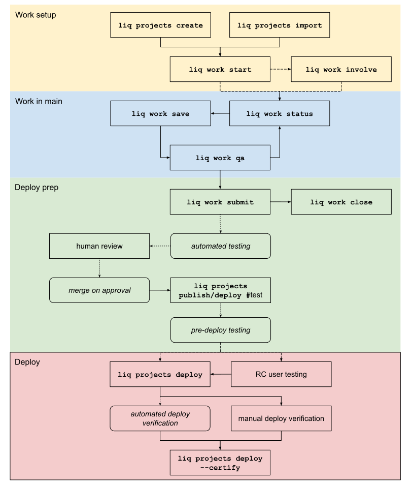

# Developing with liq

## Audience & scope

This document discusses the liq development workflow conventions and tools. This process may be broadly divided into 'change control' and 'deploy':

* change control,
  * development workflows,
  * implementing changes,
  * testing and quality assurance,
* deploy,
  * pre-deploy testing,
  * production deploy,
  * post-deploy verification and certification.

## Overview

Source: https://docs.google.com/drawings/d/1dlhK32qiEcLBg2jzwnHXRRujJajHpV8Hty_LRYPUQiA/edit; Version: Initial Version 2019-11-17

## Change control

liq change control processes are primarily organized around "work units". A work unit involves one or more issues and one or more projects.

### Preparing a work unit

*ALERT*: The interface as defined here is ahead of and differs in some aspects from the interface as implemented at the time of writing. Refer to `liq work help` for current state.

* A unit of work is created with
  `liq work start -i 24 "implement feature foo`
* A work unit may be associated with multiple issues.
* Associated issues may be 'cured' or 'related' by the associated unit of work. *'related' issues not implemented at time of writing.*.
* Issues are managed through the `liq work issues` sub-resource interface.
* A work unit may involve one or more projects.
  * `liq work start` is executed against the 'primary' project involved in a work unit.
  * Additional projects may be involved with `liq work involve`.
  * Projects may be dropped, without affecting the work unit, with `liq work drop`. *Not currently implemented.*

### Implementing changes
